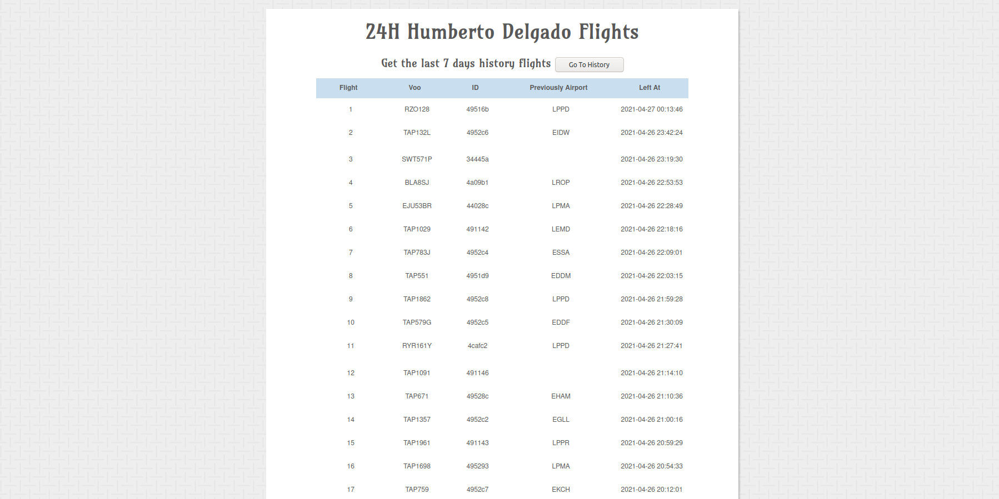
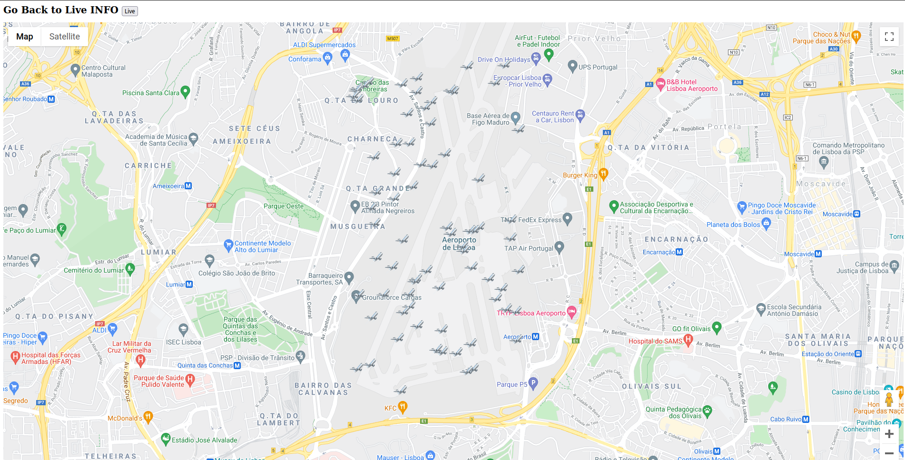
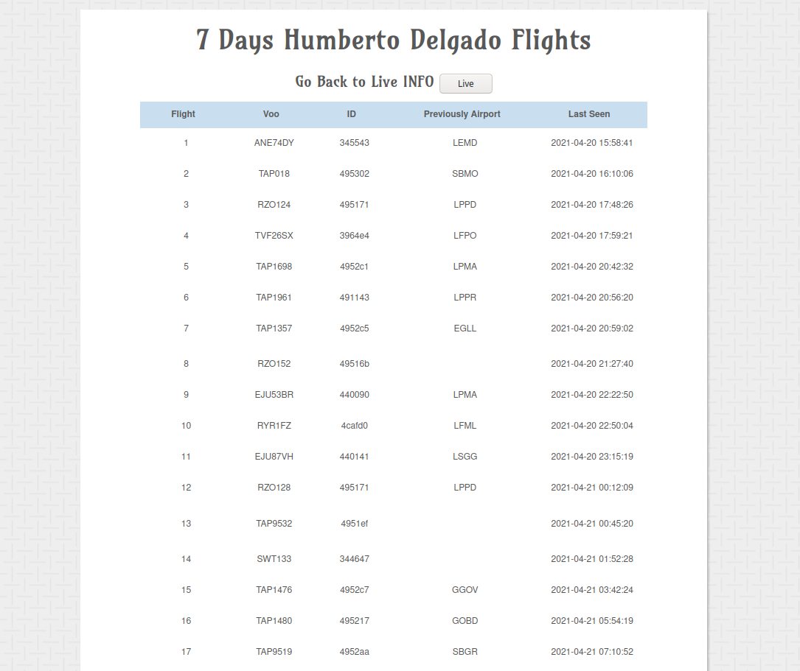
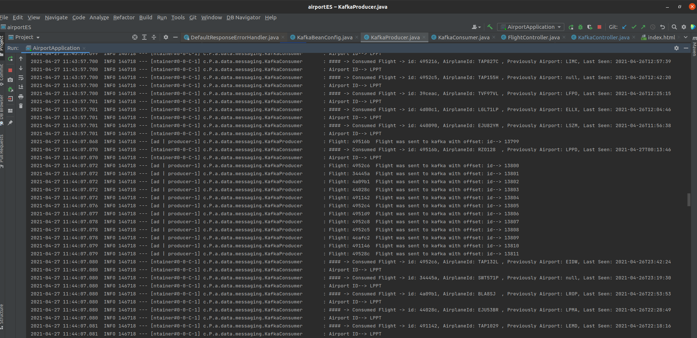

### JAVA application with Spring Boot

To Run the app  
1st----> start Docker containers: cd docker/;   docker-compose up -d;   cd .. 
2nd----> cd target/  
3rd----> "java -jar airport-0.0.1-SNAPSHOT.jar"  

## Live info about airplanes arriving LPPT Airport

## Live info about airplanes arriving LPPT Airport in a Map

## History

## Kafka

